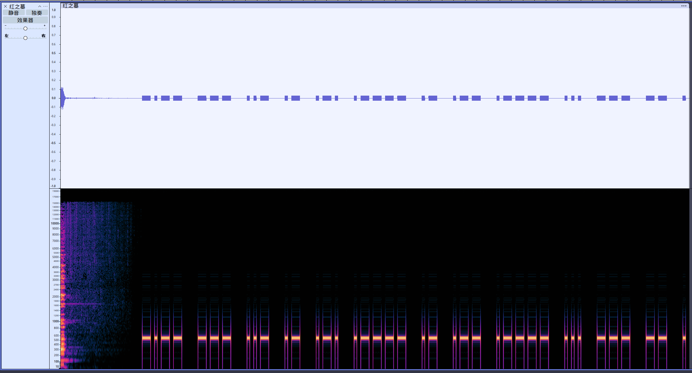
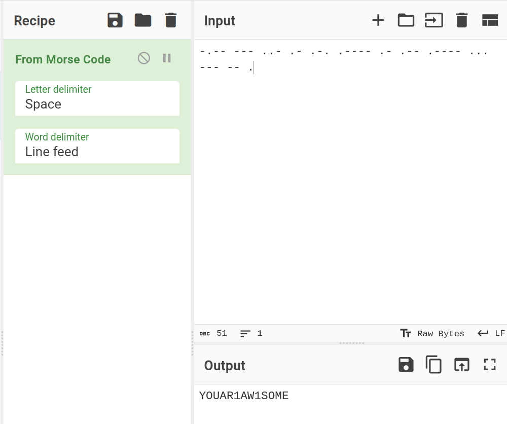

# 红之墓

## 题目描述

> Hint: 解密后的文本使用 `flag{}` 包裹

## 题目解析

使用 [Audacity](https://www.audacityteam.org/) 打开 WAV 文件，查看波形图和频谱图，能够在音频尾部找到一些间断的响声。这些声音由一系列长短不一的蜂鸣音组成，符合摩斯电码的特征。



转换为摩斯电码文本（空格作为分隔符）：

```
-.-- --- ..- .- .-. .---- .- .-- .---- ... --- -- .
```



得到文本：`YOUAR1AW1SOME`

Flag: `flag{YOUAR1AW1SOME}`
