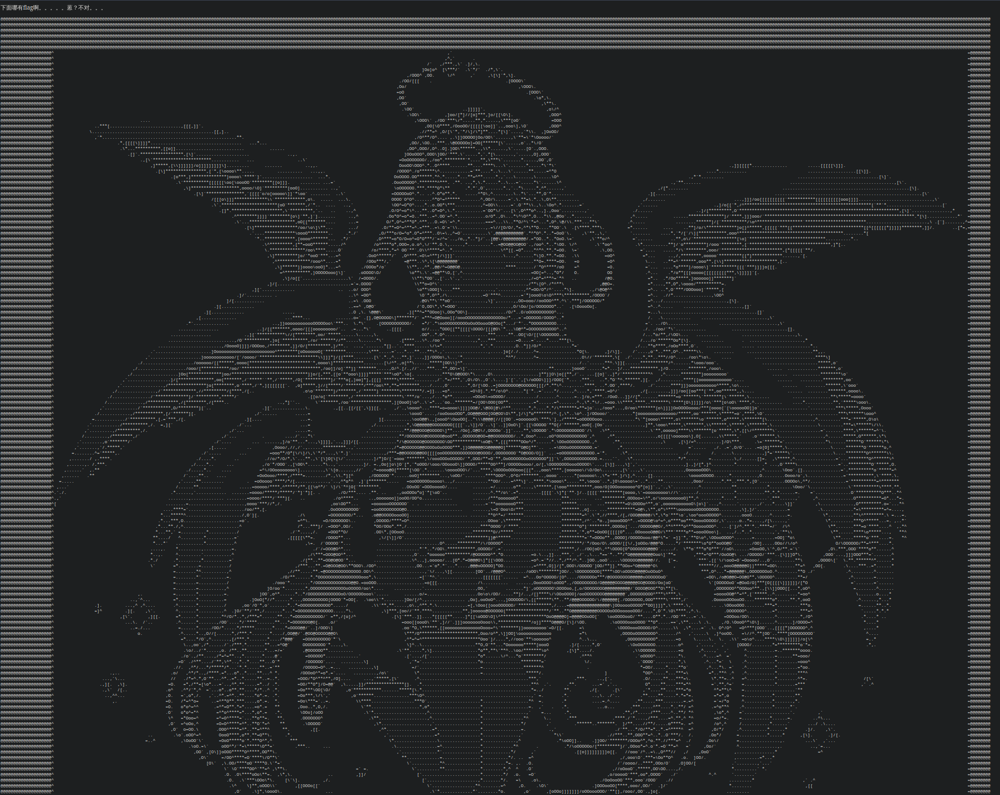
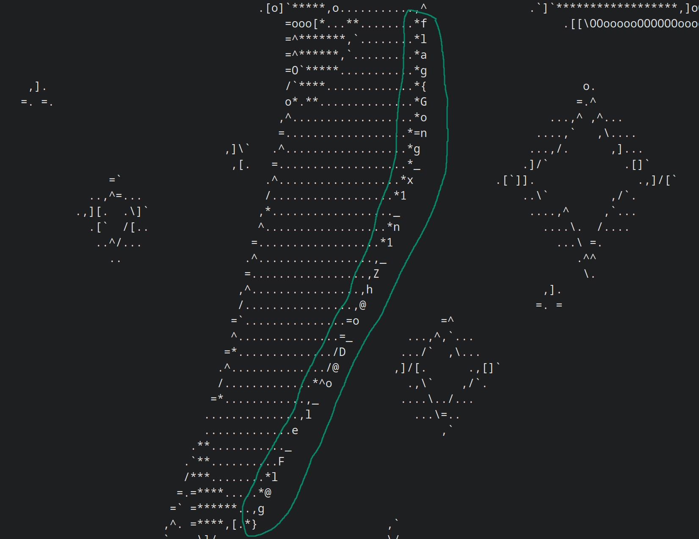

# web?

## 题目描述

## 题目解析

附件没有后缀，但内容是纯文本，根据文本格式可以推断文件为 HTML 代码。

用 `file` 命令能够直接识别：

```
$ file 游览器dack 
游览器dack: HTML document, Unicode text, UTF-8 text, with very long lines (390), with CRLF line terminators
```

使用浏览器打开文件可以看到一幅 ASCII Art：



虽然搜索各种关键词如 `flag` 等没有结果，但我们的注意力非常惊人，可以注意到某处图像外部轮廓的字符拼接起来就是 Flag：



Flag: `flag{Gong_x1_n1_Zh@o_D@o_le_Fl@g}`
