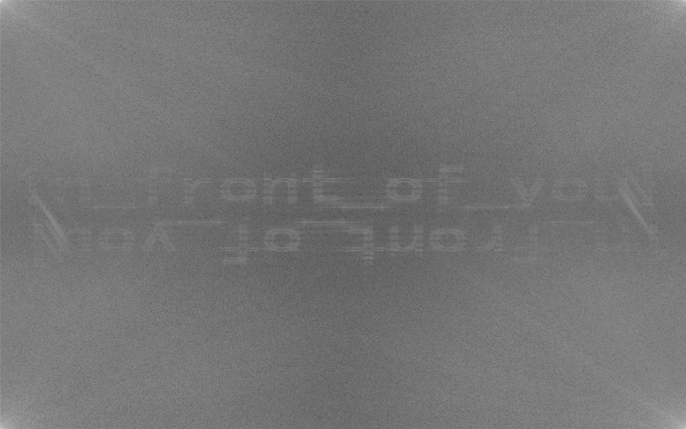

# 你好世界

## 题目描述

> Hint: 如果获取到了多段 Flag，在每段之间使用下划线 `_` 拼接

## 题目解析

图片的 EXIF 信息里发现有段备注信息，给出了第一段 Flag，以及第二段 Flag 的提示：

```
ExifTool Version Number         : 12.99
File Name                       : 雨.jpg
Directory                       : .
File Size                       : 913 kB
File Modification Date/Time     : 2024:10:31 03:00:49+08:00
File Access Date/Time           : 2024:10:31 03:00:49+08:00
File Inode Change Date/Time     : 2024:10:31 03:00:49+08:00
File Permissions                : -rw-r--r--
File Type                       : JPEG
File Type Extension             : jpg
MIME Type                       : image/jpeg
JFIF Version                    : 1.01
Resolution Unit                 : inches
X Resolution                    : 96
Y Resolution                    : 96
Exif Byte Order                 : Big-endian (Motorola, MM)
XP Comment                      : flag{The_f1ag_1s_right    第二段flag在哪里？  雨”水“可以想到什么？                                                                                                                                                                                                                                                                                                                                                                                                                                                                                                                                                                                                                                                                                                                                                                                                                                                                      工具？
Padding                         : (Binary data 268 bytes, use -b option to extract)
Image Width                     : 1728
Image Height                    : 1080
Encoding Process                : Baseline DCT, Huffman coding
Bits Per Sample                 : 8
Color Components                : 3
Y Cb Cr Sub Sampling            : YCbCr4:2:0 (2 2)
Image Size                      : 1728x1080
Megapixels                      : 1.9
```

雨「水」可以联想到图片盲水印隐写。

盲水印工具选择非常的「特定」，因为不同工具可能使用不同的算法，有的需要原图有的不需要，所以，找到题目作者使用的工具效果最好。

作者使用的是一个叫做「隐形水印工具 (WaterMarkH)」的工具，我用的是 [BlindWatermark](https://github.com/ww23/BlindWatermark)，提取出来文字不够清晰。

```
java -jar BlindWatermark-v0.0.3-linux-x86_64.jar decode -f 雨.jpg output.png
```



二值化之后可能更好看一些：

```
magick output.png -threshold 50% output-2.png
```


Flag: `flag{The_f1ag_1s_right_1n_front_of_you}`

多段 Flag 需要用 `_` 拼接。
