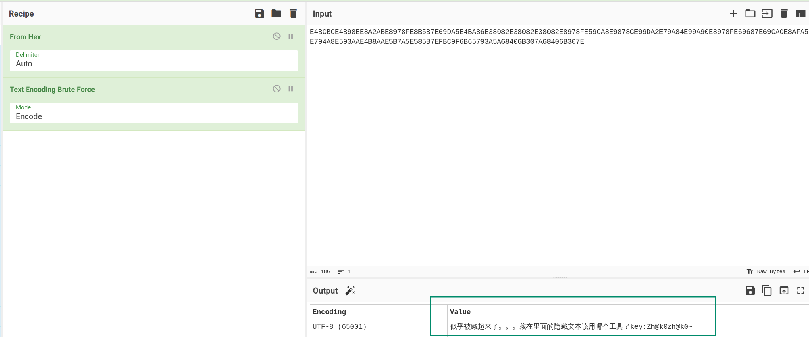
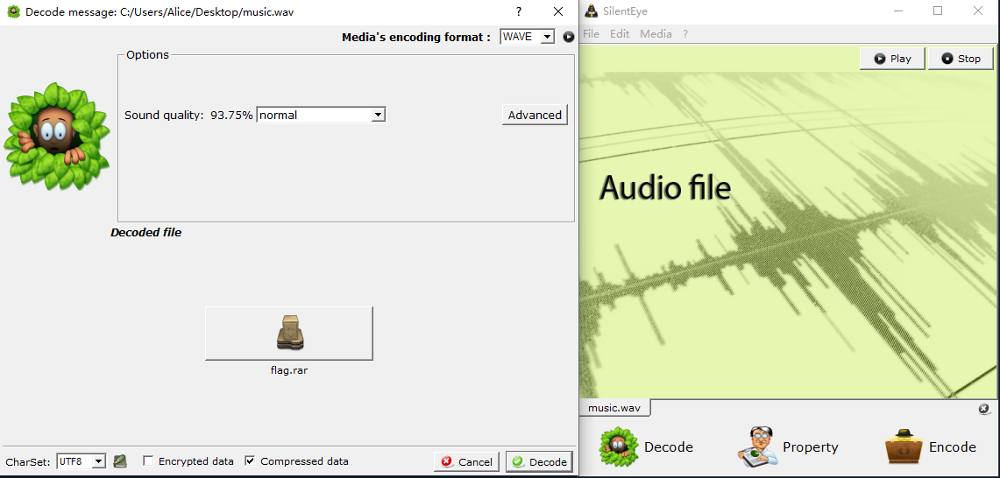

# Music

## 题目描述

## 题目解析

附件是 WAV (Waveform Audio File Format) 音频文件，通过搜索文件中的 `flag` 字符串，可以找到一个提示 `key__where`，并且在其上方还有一串 Base16 字符串：

```
$ xxd music.wav | rg flag -B 15
00e67700: ffff 0200 0000 0400 ffff 0400 fcff 0000  ................
00e67710: 0100 0200 0200 0100 0000 0000 0200 0400  ................
00e67720: 0000 0300 0100 0100 0200 0100 0100 0000  ................
00e67730: 4534 4243 4243 4534 4239 3845 4538 4132  E4BCBCE4B98EE8A2
00e67740: 4142 4538 3937 3846 4538 4235 4237 4536  ABE8978FE8B5B7E6
00e67750: 3944 4135 4534 4241 3836 4533 3830 3832  9DA5E4BA86E38082
00e67760: 4533 3830 3832 4533 3830 3832 4538 3937  E38082E38082E897
00e67770: 3846 4535 3943 4138 4539 3837 3843 4539  8FE59CA8E9878CE9
00e67780: 3944 4132 4537 3941 3834 4539 3941 3930  9DA2E79A84E99A90
00e67790: 4538 3937 3846 4536 3936 3837 4536 3943  E8978FE69687E69C
00e677a0: 4143 4538 4146 4135 4537 3934 4138 4535  ACE8AFA5E794A8E5
00e677b0: 3933 4141 4534 4238 4141 4535 4237 4135  93AAE4B8AAE5B7A5
00e677c0: 4535 3835 4237 4546 4243 3946 3642 3635  E585B7EFBC9F6B65
00e677d0: 3739 3341 3541 3638 3430 3642 3330 3741  793A5A68406B307A
00e677e0: 3638 3430 3642 3330 3745 2e2e 0000 0000  68406B307E......
00e677f0: 666c 6167 7b6b 6579 5f5f 7768 6572 657d  flag{key__where}
```

Base16（其实也就是 Hex）解码得到提示和一个密钥：



```
似乎被藏起来了。。。藏在里面的隐藏文本该用哪个工具？key:Zh@k0zh@k0~
```

联想到可以在 WAV 音频文件中隐藏信息的工具 [SilentEye](https://achorein.github.io/silenteye/)（真是联想力惊人呢）。

使用 SlientEye 解出 `flag.rar`。



使用密码 `Zh@k0zh@k0~` 解压得到 `flag.txt`。

Flag: `flag{G0n_x1_n1_zh@0_d@0_le_f1@g}`
