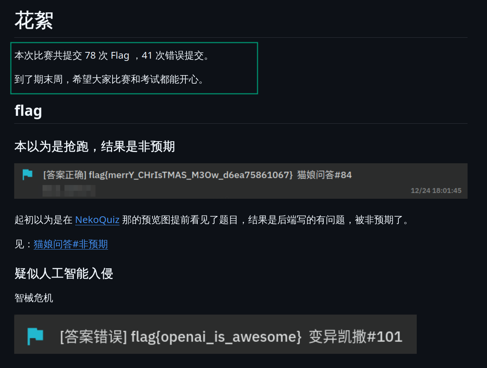

# 猫咪问答

## 题目描述

> Hint: 此题属于 OSINT 类型，所有问题均可通过网络搜索完成，不需要任何线下活动。

## 题目解析

题目形式仿照 [USTC-Hackergame-2023-猫咪小测](https://github.com/USTC-Hackergame/hackergame2023-writeups/blob/master/official/%E7%8C%AB%E5%92%AA%E5%B0%8F%E6%B5%8B/README.md)，可以去翻看一下历届的猫咪小测/猫咪问答，对这类搜索题目有进一步的了解。

SVUCTF 参照此类形式制作过多次信息检索题：

- [SVUCTF/SVUCTF-SPRING-2024 猫咪问答](https://github.com/SVUCTF/SVUCTF-SPRING-2024/tree/main/challenges/misc/neko_quiz)
- [SVUCTF/SVUCTF-WINTER-2023 猫娘问答](https://github.com/SVUCTF/SVUCTF-WINTER-2023/tree/main/challenges/misc/neko_quiz)

### Q1

> 1\. 在 SVUCTF 2023 年冬季赛中，全场一共提交多少次 Flag？其中多少次错误提交？

搜索引擎搜索「SVUCTF」可以得到 SVUCTF 官方的 GitHub 帐号主页，在其中能够找到 2023 年冬季赛 [SVUCTF-WINTER-2023](https://github.com/SVUCTF/SVUCTF-WINTER-2023) 的仓库地址。

仓库说明中找到花絮：

花絮中记录了全场提交 Flag 次数和错误次数：

答案：`78_41`

### Q2

> 2\. 我校一号门旁的体育中心曾有一家「华莱士」，后来中间的「莱」字因为种种原因去掉了，成了「华 士」，再后来它就关门了。你能找出在炸鸡店之前那里开的是什么店吗？

不太清楚网络上会不会有人记录过那里原来的照片，也许那个时候社交网络还不够发达。

像这种具体位置的「时光回溯」，推荐使用各大地图的街景功能，国内地点就更推荐国内地图。

先在百度地图搜索定位到「苏州市职业大学 1 号门」，点击右下角的「全景」按钮，点击附近街道进入街景页面。

移动场景，可以在体育馆外侧、横越路的路旁，找到被树遮挡着的「华 士」。

左下角「时光机」功能可以回看同一位置以往拍摄的全景照片。回到 2014 年 5 月，能够发现那里原来是类似美食城的一家店铺，叫做「旺厨美食园」。

如果时光机没有那么多年份，可以考虑略微调整相机位置。

答案：`旺厨美食园`

我新生报道的那年还去这家「华 士」吃过，还蛮宽敞干净的，放假再回到学校就见不到它了。

我真的好想再吃一次那里的炸全鸡。

### Q3

> 3\. Python 3.13.0 的最后一个 Alpha 版本发布于什么日期？

题目出得较早，随着时间推移，这些公共信息被搜索引擎收录得越来越多，难度稍微下降了。

如果你在比赛末期直接在搜索引擎中输入中文的「Python 3.13.0 的最后一个 Alpha 版本」，应该能够得到 Python 的官方文档链接。而在出题时，需要用英文搜索关键字「Python 3.13.0 Alpha Docs」。

推荐同学们对于可能的英文结果，优先使用英文关键词搜索，结果更多更准确。

[https://docs.python.org/zh-cn/3.13/whatsnew/3.13.html](https://docs.python.org/zh-cn/3.13/whatsnew/3.13.html)

文档中描述了 Python 3.13 的新变化，并且列出了「PEP 719」Python 的发布时间表。

文中「Release Schedule」部分展示了各版本的发布日期，其中最后一个 Alpha 版本的日期为 `2024-04-09`：

答案：`2024-04-09`

赛中发现有的选手询问 AI 时 AI 给出 `2024-04-10` 的答案，官方文档的时间是基于 UTC 的，不会出现与本地时间超过一天的时差。

而 GitHub 仓库中的 Commit 是北京时间 4 月 9 日下午 5 点 56 分，全球范围依然是 4 月 9 日。

我只能理解为 AI 吃了某些文章的发布日期，或单纯出错了。

### Q4

> 4\. 几个月前 RFC 提出了一种利用大语言模型实现的超光速传输网络协议。然而，这种协议可能面临一种特殊攻击：预测未来的数据包，并提前将其发送到目的地。这种新型攻击手段的名称是什么？

首先什么是 RFC ：

> Request For Comments (RFC) 是一系列以编号排定的文件。文件收集了有关互联网相关信息，以及 UNIX 和互联网社区的软件文件。RFC 文件是由 Internet Society (ISOC) 赞助发行。基本的互联网通信协议都有在 RFC 文件内详细说明。RFC 文件还额外加入许多在标准内的论题，例如对于互联网新开发的协议及发展中所有的记录。因此几乎所有的互联网标准都有收录在 RFC 文件之中。

RFC 文档包含了计算机网络的方方面面，绝大部分网络标准的制定都是以 RFC 的形式开始。

但 RFC 也并非全部是严肃的技术文件，偶尔也有恶搞之作，通常发布在 4 月 1 日愚人节，每一篇都乍有其事地拟定各项标准。

例如：

- RFC 1149： 鸽载互联网协议。以鸽子作为载体传输数据，传输可靠性差，鸟类容易受到天气和环境等因素的影响，如遇极端天气，丢包率可高达100%...

- RFC 1606：从历史的角度看 IPv9 的使用。文档中称过去几年里 IPv9 的普及率惊人，但由于太阳系上智能生命以及超光速传输堆栈的并行发现使可用空间急剧减少，把 IPv9 可寻址组件注射到血流中还不确定...

- RFC 2324：超文本咖啡壶控制协议（HTCPCP）。制定了一系列控制联网咖啡壶的协议，甚至真的衍生出了 418 这个 HTTP 状态码...

以及[去年冬季赛](https://github.com/SVUCTF/SVUCTF-WINTER-2023/blob/main/challenges/misc/neko_quiz/README.md)时提问的 RFC 5841 ——「TCP 包的情绪选项」。

而这里的「超光速传输网络协议」显然也是一部恶搞作品，首要目标就是找到对应的 RFC 文档。

可以搜索引擎中使用类似题目中的关键词搜索「RFC faster than light protocol LLM」。

得到 RFC 编号和文档链接。

在文档中安全考量「Security Considerations」一节里，可以看到可能遭受的攻击方式，以及攻击的名称 `futureplay`。

答案：`futureplay`

这个名称是基于现实中重放攻击的名称 `replay` 恶搞而来的。

另外一种做法是找到可以按照时间排序检索 RFC 文档的站点，翻看「几个月前」范围内的文档，找到符合的关键字。

这类影响力较大的公共信息直接询问 AI 也是个不错的选择。