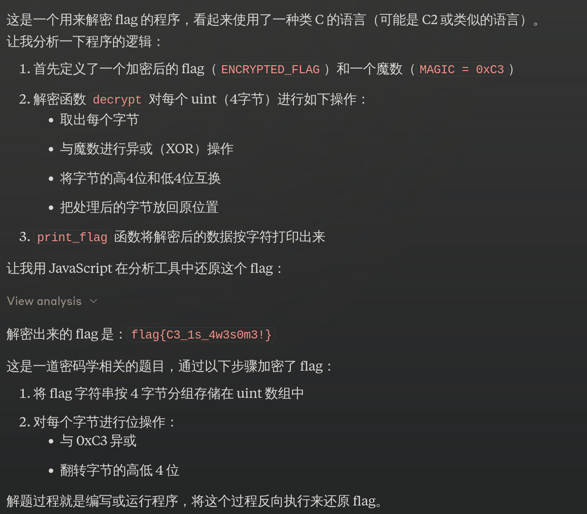

# RunMe\[C3\]

## 题目描述

C3 是一门从 C 语言演化而来的极简系统编程语言。本题你需要根据官方文档配置好 C3 编译器环境，编译并运行附件代码获取 Flag。

## 题目解析

附件源码：

```c
module runme;
import std::io;

const uint[] ENCRYPTED_FLAG = {
    0xb5d505a5, 0x36f0f774, 0x8036f4d0, 0xc0f4f0b4, 0x14d1f015
};

const uint MAGIC = 0xC3;

fn void decrypt(uint[] data)
{
    foreach (&value : data)
    {
        for (int i = 0; i < 4; i++)
        {
            uint byte = (*value >> (8 * i)) & 0xFF;
            byte ^= MAGIC & 0xFF;
            byte = ((byte >> 4) | (byte << 4)) & 0xFF;
            *value &= ~(0xFF << (8 * i));
            *value |= byte << (8 * i);
        }
    }
}

fn void print_flag(uint[] data)
{
    foreach (value : data)
    {
        for (int i = 0; i < 4; i++)
        {
            char c = (char)(value & 0xFF);
            io::printf("%c", c);
            value >>= 8;
        }
    }
    io::printn();
}

fn void main()
{
    uint[] flag = ENCRYPTED_FLAG;
    decrypt(flag);
    print_flag(flag);
}

```

这是 [C3](https://c3-lang.org/) 语言的代码，C3 是一种极简系统编程语言，旨在成为 C 语言的一种“演化”，和 C 语言语法很像吧。

出这题是因为，其他几个 RunMe 的语言在网络上配置教程过多，或者可以使用在线解释器或在线编译器完成。

这里希望同学们能够学会阅读官方文档而不是网络教程，动手配置一个新语言或新工具的环境，这样的技能在今后会很有用。

点击[官网](https://c3-lang.org/)首页的「Installation Guide」进入安装指南，官方为不同的系统提供了安装教程。

有两种安装方式，一种是下载「Prebuilt binaries 」也就是预先构建好的编译器二进制文件，另一种是下载编译器源码手动编译。推荐前者，愿意挑战的同学可以尝试跟随「Build C3 From Source」一章。

Windows 上安装相对麻烦，需要下载额外文件，所以这里就以 Windows 为例。

首先下载[最新的编译器](https://github.com/c3lang/c3c/releases/download/latest/c3-windows.zip)，将其解压到一个文件夹中。

如果你已经安装了 Visual Studio 17，那么你可以直接使用。如果没有则需要运行 Python 脚本下载一些编译所需文件（MSVC 编译器相关、Windows SDK、头文件和库等等）。

```
python msvc_build_libraries.py
```

打印帮助信息，了解编译命令：

```
.\c3c.exe --help
```

使用 `compile-run` 命令编译并执行 C3 程序：

```
.\c3c.exe compile-run runme.c3
```

Flag: `flag{C3_1s_4w3s0m3!}`

语言较新，可能语法相关会经常变动，就赛题制作到比赛结束这段时间内，C3 一直是 0.6.x 版本，可以编译通过。

## 其他

正规解法是这样，但光是得到 Flag 还是有蛮多路子的。

比如将这段代码丢给 AI，让它们编写一个类似的 C 语言源码，然后编译执行。

又或者直接让他们写出反向的解密程序，得到 Flag：



算是预料到的非预期，但对于一个 200 分的题目来说，怎样做都能接受了。
