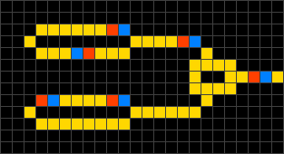
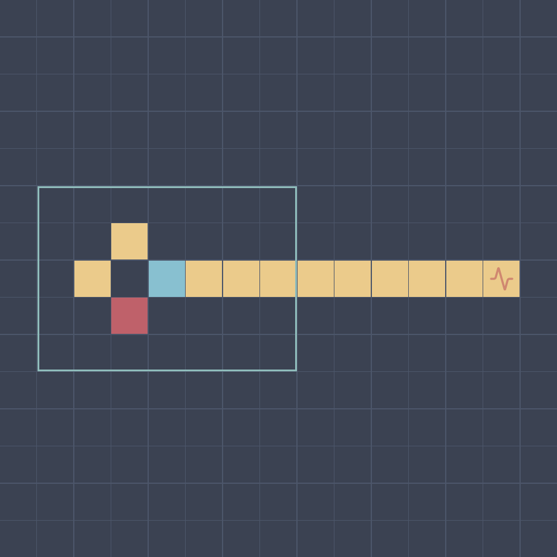
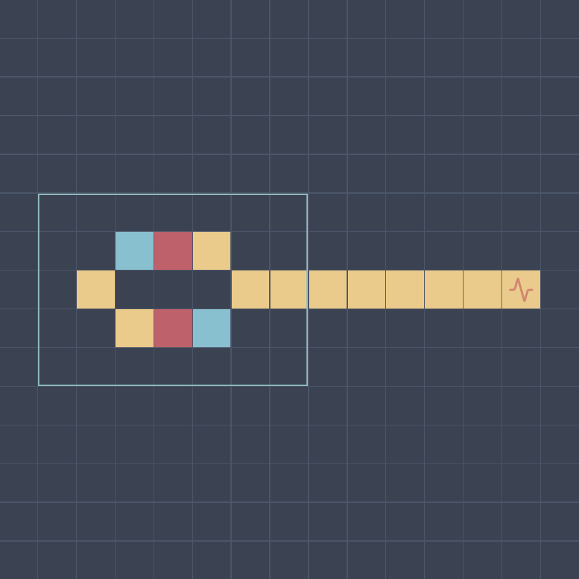

# Wireworld - LEVEL 0

## 题目描述

你知道 [Wireworld](https://en.wikipedia.org/wiki/Wireworld) 吗？它是一种特殊的[元胞自动机](https://en.wikipedia.org/wiki/Cellular_automaton)，用于模拟电子电路。

你的任务是使用不同类型的细胞（空白、导体、电子头、电子尾），在给定的网格中设计一个电路，使其满足特定的条件。

> 元胞自动机 (cellular automaton)，简单但强大的计算模型：
>
> - 由网格中的许多小单元（称为细胞）组成
> - 每个细胞有有限的状态（如开 / 关）
> - 细胞根据简单的规则更新自己的状态
> - 这些规则通常基于周围细胞的状态
> - 虽然规则简单，却可以产生复杂的行为

> Hint: 页面显示「Loading...」请等待几秒后刷新网页

## 题目解析

### 什么是元胞自动机

对于初次接触元胞自动机的选手来说，可以把它想象成一个棋盘游戏。每个格子就像一个小生命体，按照简单的规则不断变化自己的状态。

最著名的例子就是「康威生命游戏 (Conway's Game of Life)」：

想象一个大棋盘，每个格子可以是「存活」或「死亡」两种状态。

- 每个格子会观察它周围 8 个相邻格子的状态
- 如果一个活着的格子周围活细胞太少（少于 2 个），它会因为「孤独」而死亡
- 如果周围活细胞太多（超过 3 个），它会因为「拥挤」而死亡
- 如果一个死去的格子恰好有 3 个活邻居，它会「重生」

虽然规则很简单，但是这个系统可以产生令人惊叹的复杂图案：

- 滑翔机：一组细胞会像飞机一样在棋盘上滑行
- 信号灯：一组细胞会不断闪烁，就像交通信号灯
- 静物：一些特定图案会永远保持稳定

而本题中的 Wireworld 就是另一种有趣的元胞自动机，专门用来模拟电路。每个格子可以是：

- 空白：绝缘体
- 电子头：正在移动的电子
- 电子尾：电子刚刚经过的位置
- 导体：电线

在每次迭代中，四种细胞分别发生以下变化：

- 空 -> 空
- 电子头 -> 电子尾
- 电子尾 -> 导体
- 当导体拥有一至两个电子头邻居时，导体 -> 电子头，否则导体不变

### 解题过程

挑战描述：

> 你需要在 70 步内，让右侧检测器收到周期为 4 的电子，并稳定一段时间。

也就是说，需要设计一个电路，使电子每隔 4 步就到达右侧的检测器（心电图标志）一次。

构建一个长度为 4 的循环导线，并接出一根导线连通检测器，然后在循环电路中创建一个电子头和一个相邻的电子尾，使电子沿着循环导线运动。

另外，你也可以构建一个长度为 8 的循环导线，然后加入两个中心对称的电子。

## 其他

题目框架源码在 [base/wireworld](../../../base/wireworld/)，写得比较糙。完全依赖于 WebSocket 实时传输结果显示，没做额外处理，会因为网络影响导致显示速度不均，而且缺乏调试功能。

推荐先在一些在线模拟器中测试电路。
