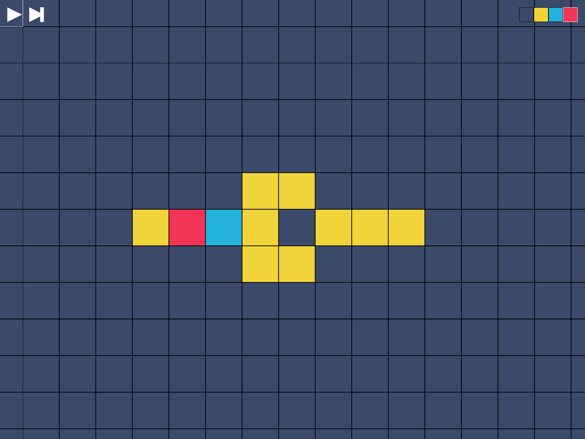
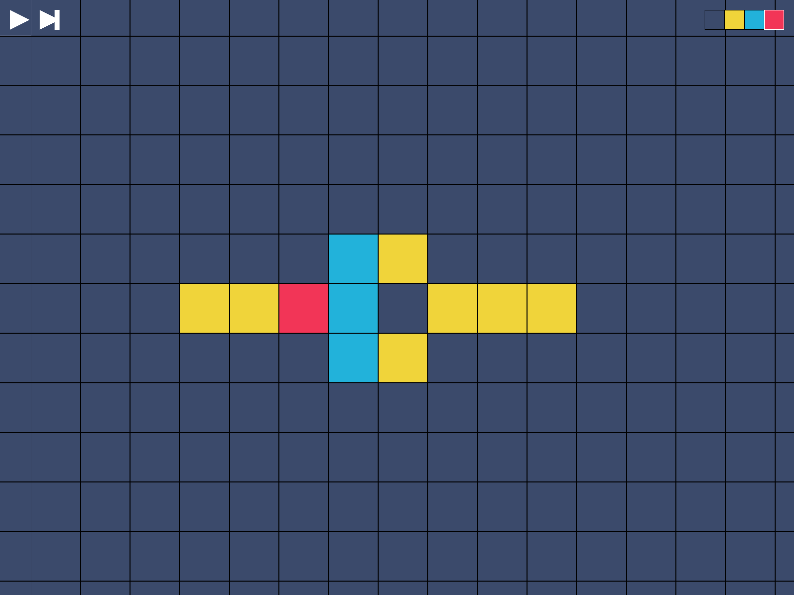
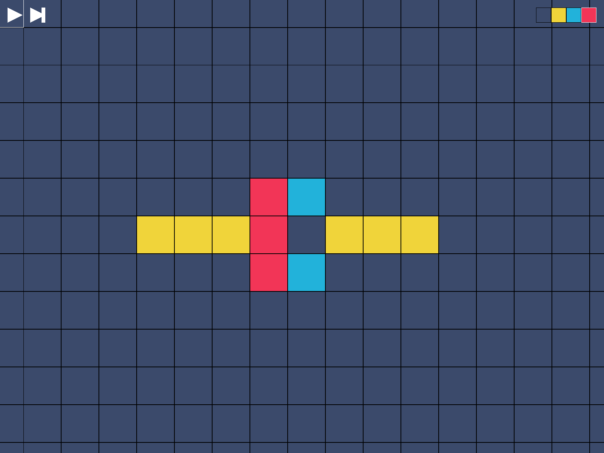
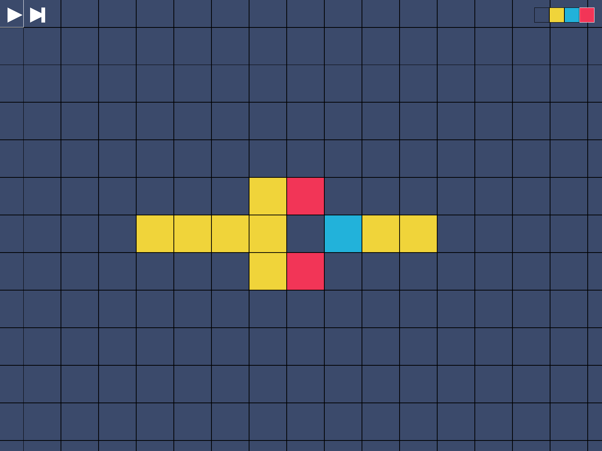
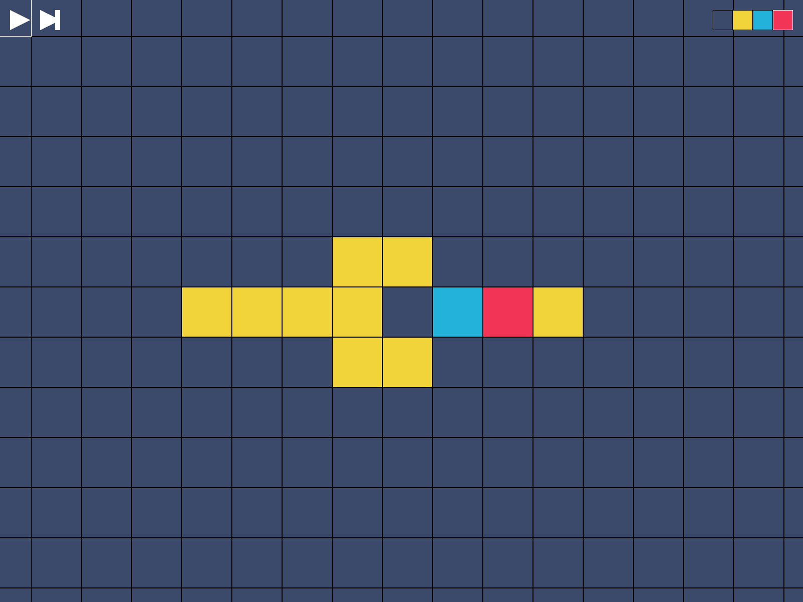
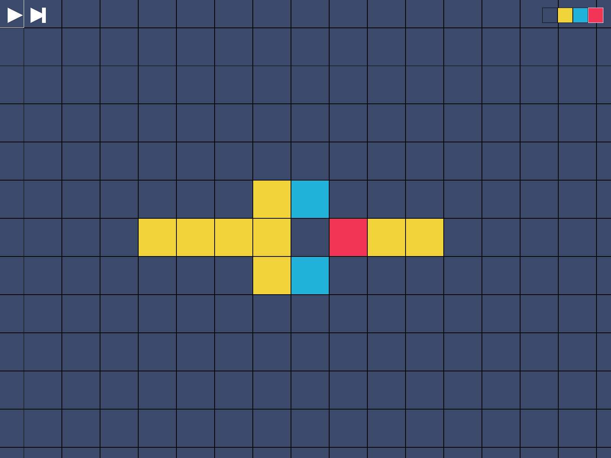
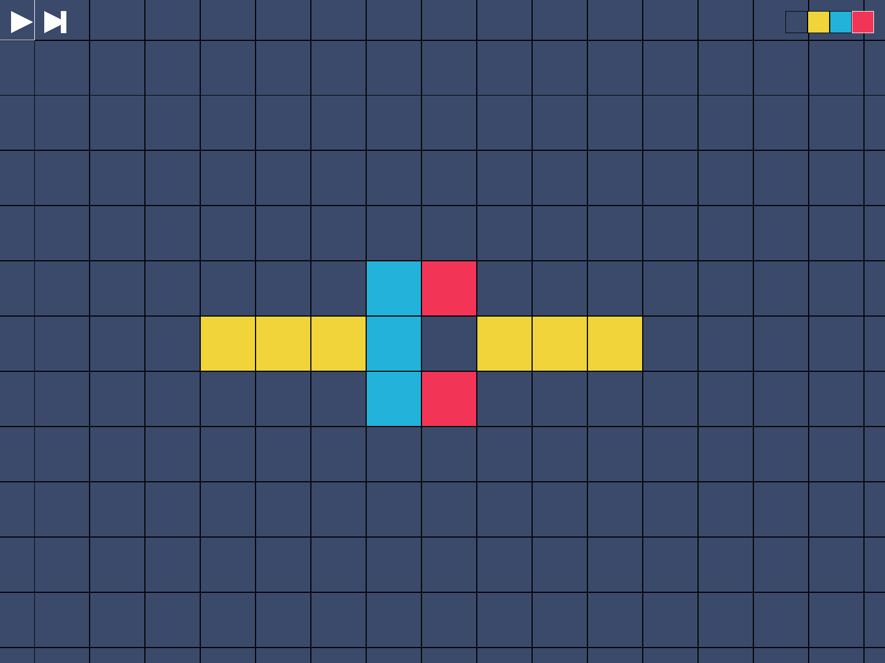
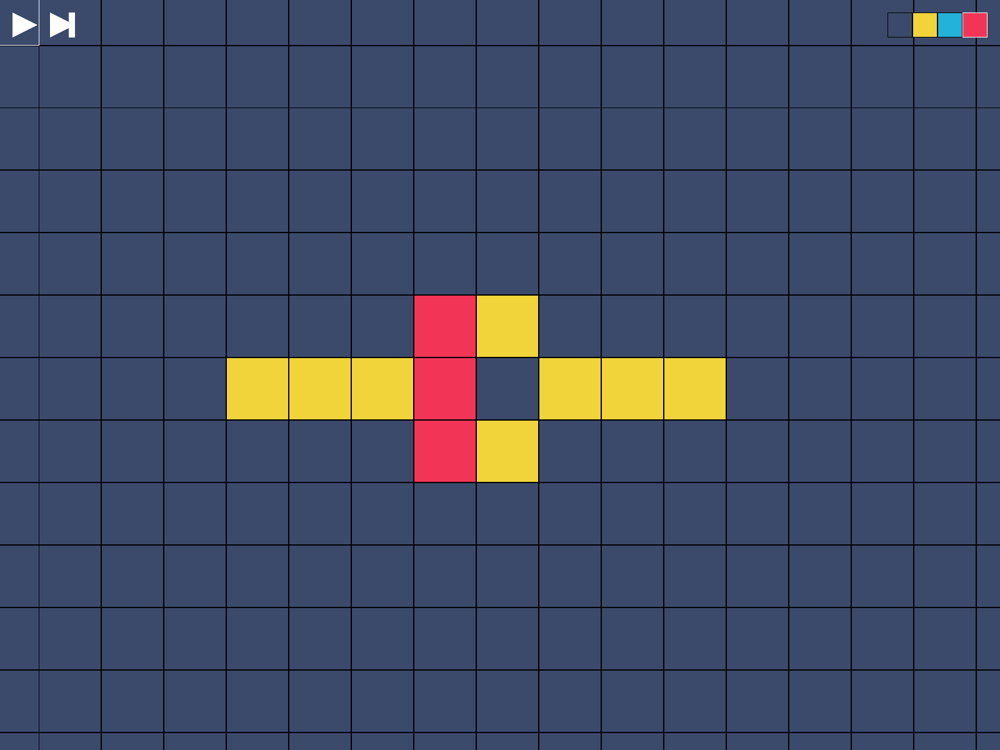
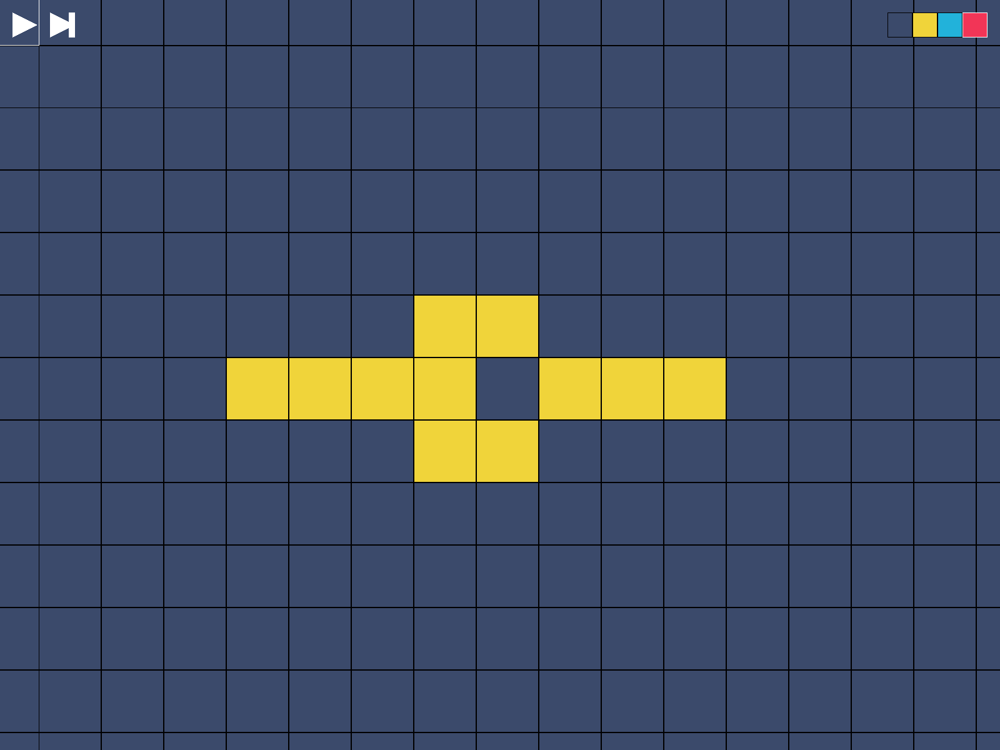
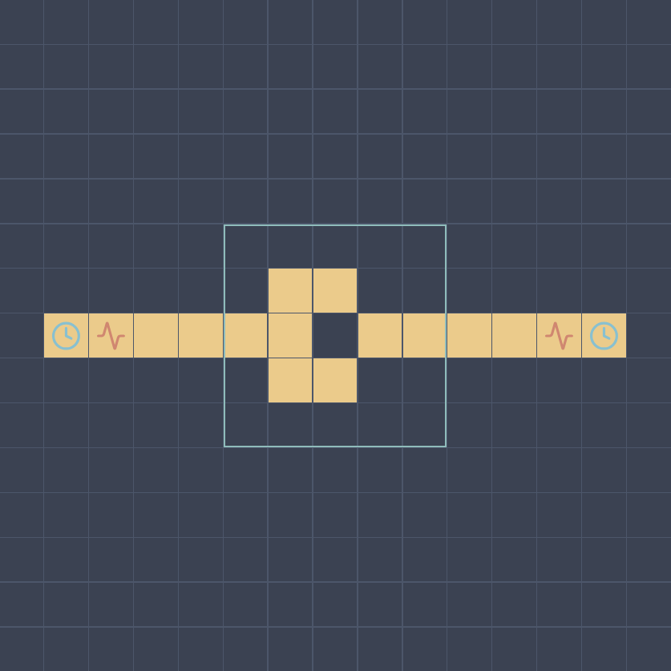

# Wireworld - LEVEL 1

## 题目描述

你知道 [Wireworld](https://en.wikipedia.org/wiki/Wireworld) 吗？它是一种特殊的[元胞自动机](https://en.wikipedia.org/wiki/Cellular_automaton)，用于模拟电子电路。

你的任务是使用不同类型的细胞（空白、导体、电子头、电子尾），在给定的网格中设计一个电路，使其满足特定的条件。

> 元胞自动机 (cellular automaton)，简单但强大的计算模型：
>
> - 由网格中的许多小单元（称为细胞）组成
> - 每个细胞有有限的状态（如开 / 关）
> - 细胞根据简单的规则更新自己的状态
> - 这些规则通常基于周围细胞的状态
> - 虽然规则简单，却可以产生复杂的行为

> Hint: 页面显示「Loading...」请等待几秒后刷新网页

## 题目解析

请先查看 [LEVEL 0 中关于元胞自动机的简介](../wireworld_level0/README.md#%E4%BB%80%E4%B9%88%E6%98%AF%E5%85%83%E8%83%9E%E8%87%AA%E5%8A%A8%E6%9C%BA)。

挑战描述：

> 还记得你在 LEVEL 0 制作的电路吗，它现在被整合成一个组件——时钟发生器。
>
> 左右两侧的时钟发生器会先后射出电子，你需要让右侧检测器收到左侧传来的电子，而左侧检测器收不到右侧传来的电子。

上关制作的电路其实叫做时钟发生器 (Clock generator)，这种装置在现实世界的数字电路里非常重要，它可以不断产生固定频率的脉冲信号，用于同步电路操作。

现在它被整合成为一个组件，应用在关卡里，用时钟图标表示。悬浮在组件上可以看到它的属性，比如时钟发生器的周期、哪一步启动、哪一步结束。

同样的，悬浮在检测器上可以查看它的检测状态。

这关左右两边的时钟发生器会先后运行，周期为 4 地产生电子，要让右侧检测器受到左侧传来的电子，而左侧检测器收不到右侧传来的电子。

简单的画条导线连接左右是不行的，这不满足「电流能通向右边，但不能通向左边」。

这种单向的通道可以让人联想到现实中的「二极管 (Diode)」，它也是只允许电流单向流动的元件。

那么如何在 Wireworld 中构造一个二极管呢？

回顾细胞规则：

- 导体只有在周围有 1-2 个电子头时才会变成电子头
- 当周围有 3 个或更多电子头时，导体不会被激发

这个规则给了我们一个关键的启发：我们可以利用“过量”的电子头来阻止信号传播。

- 正向传输（左到右）：
    - 当左边的时钟发生器发出电子时，电子沿着导线传播到右边
    - 由于这时右边没有其他电子干扰，电子可以顺利到达右侧检测器
- 反向阻断（右到左）：
    - 当右边的时钟发生器发出电子时，我们可以设计一个特殊的"交汇结构"
    - 在交汇点安排额外的导线，引入更多电子
    - 当右侧电子到达交汇点时，周围会同时出现 3 个或更多电子头
    - 根据规则，导体不会被激发，信号就被“掐死”了
    - 这样电子就无法继续向左传播

以下几张图是这种特殊“交汇结构”的示例，观察从左到右和从右到左传输过程中的细胞变化：

从左到右：

从右到左：

可以发现，从右到左同时出现了 3 个电子头，于是左侧的导体不会被激发。

于是最终的电路为：

## 其他

其实本来这题有 LEVEL 3 的，阅读源码的话也能看见我把二极管也制作为了一个组件。

目的是为了 LEVEL 3 中更复杂的关卡，预期是需要组合各种门电路，利用各种组件。

但因为比赛时间等种种原因，没来得及制作，有点可惜。
