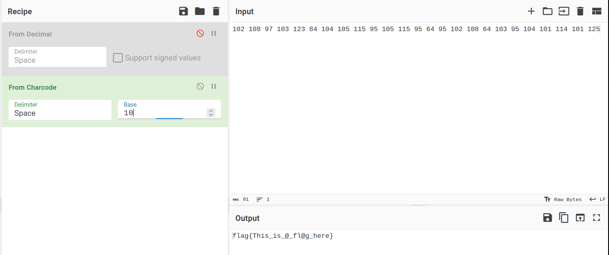

# 不是哥们？

## 题目描述

## 题目解析

附件文本为[阴阳怪气编码](https://github.com/mmdjiji/yygq.js)，它的编码原理很简单：

1. 将文本转换为二进制
    - ASCII 字符（码值 \<127）：转为 8 位二进制，不足 8 位在前面补 `0`
    - Unicode 字符（码值 >=127）：转为 16 位二进制，不足 16 位在前面补 `1`
1. 将二进制数字替换成两种中文短语：
    - `0` 转换为 `就 这 ¿ `
    - `1` 转换为 `不 会 吧 ？ `

可以使用[在线网站](https://jiji.pro/yygq.js/)解码得到一串 ASCII 码：

```
102 108 97 103 123 84 104 105 115 95 105 115 95 64 95 102 108 64 103 95 104 101 114 101 125
```

使用 [CyberChef](https://github.com/gchq/CyberChef) 将其转换为字符：



Flag: `flag{This_is_@_fl@g_here}`
