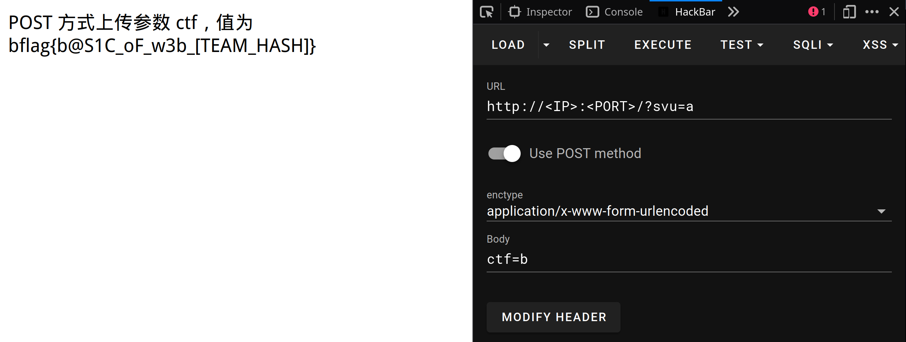

# Param

## 题目描述

## 题目解析

### 前置知识

#### HTTP 协议

HTTP（超文本传输协议）是 Web 应用中最常用的协议。当我们访问网站时，浏览器就是通过 HTTP 协议与服务器通信的。

HTTP 请求主要包含以下几个部分：

- 请求行：包含请求方法（`GET`、`POST` 等)、URL 和 HTTP 版本
- 请求头：包含一些附加信息，如 `User-Agent`、`Cookie` 等
- 空行
- 请求体：`POST` 请求会在这里携带数据

更多信息可以查看 [HTTP 消息](https://developer.mozilla.org/zh-CN/docs/Web/HTTP/Messages)。

#### HTTP 请求方法

在这道题中，我们主要用到两种 HTTP 请求方法：

- GET 方法：
    - 参数直接附加在 URL 后面，使用 `?` 分隔 `URL` 和参数，参数间用 `&` 分隔
    - 例如：`http://example.com?name=value&name2=value2`
    - 参数会显示在浏览器地址栏中
    - 长度受限制
- POST 方法：
    - 参数在请求体中传输
    - 可以传输大量数据
    - 参数不会显示在地址栏中

#### 常用工具

可以进行 HTTP 交互的工具有很多：

- 浏览器开发者工具：一些浏览器的开发者工具具有编辑重发功能
- [HackBar](https://github.com/0140454/hackbar)：针对 Web 安全测试的浏览器扩展
- [Burp Suite](https://portswigger.net/burp)：专业的 Web 渗透测试工具
- [Postman](https://www.postman.com/)：图形界面的 API 测试工具
- 命令行工具：如 curl
- 各种编程语言：如 Python
- ...

### 解题过程

首次访问页面时，会提示需要使用 GET 方式传递参数 `svu`，值为 `a`。

对于 GET 请求，可以直接在浏览器地址栏的 URL 中添加 `?svu=a`：

```
http://<IP>:<PORT>/?svu=a
```

成功传递 GET 参数后，页面会显示下一步提示：需要使用 POST 方式传递参数 `ctf`，值为 `b`。

这一步需要构造 POST 请求（GET 参数也需要保留），有多种方法可以实现:

使用 curl 命令：

```
$ curl "http://<IP>:<PORT>/?svu=a" -d "ctf=b" 
```

使用 HackBar：



使用 Python：

```python
import requests

url = "http://<IP>:<PORT>/"
params = {"svu": "a"}
data = {"ctf": "b"}
response = requests.post(url, params=params, data=data)
print(response.text)
```
